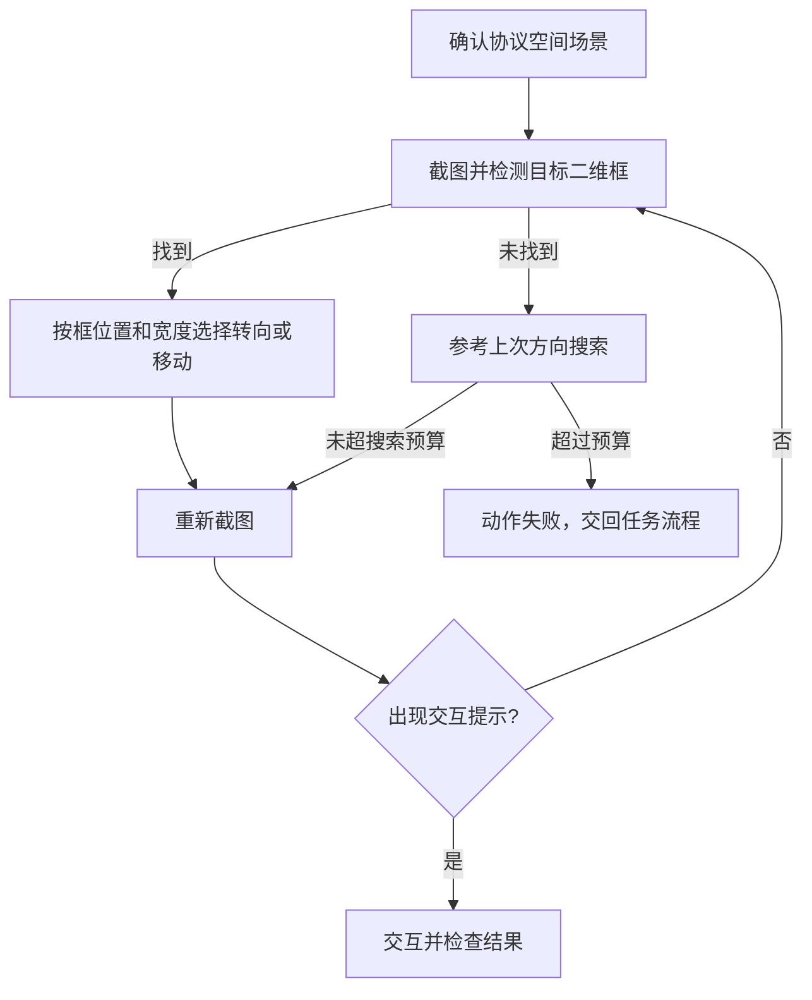

# MaaEnd 如何识别三维场景中的目标

分析日期：2026-10-03。

源码快照：[MaaEnd `aa44b0aecf8e5bd6428cafba1bc57f5348e641bf`](https://github.com/MaaEnd/MaaEnd/tree/aa44b0aecf8e5bd6428cafba1bc57f5348e641bf)。模型快照：[MaaEnd-AI `3178323b321a5853a929dd3c4b98896ec0eb4f45`](https://github.com/MaaEnd/MaaEnd-AI/tree/3178323b321a5853a929dd3c4b98896ec0eb4f45)，为上述源码锁定的模型子模块版本。

本分析核查了 Pipeline、Go / C++ 实现，并读取协议空间与自动战斗 ONNX 文件的内嵌元数据。未运行终末地实机测试；下文不据此推断识别准确率、帧率或在洛克中的效果。

## 核心结论

在本次核查的协议空间目标、自动战斗、自动拾取、农田标记与地图导航流程中，MaaEnd 采用的是二维视觉识别、短步反馈控制，以及独立的地图定位与导航数据。

它可以操控三维游戏里的目标，但这些流程并没有向控制器提供任意目标的三维包围盒、深度图或完整三维姿态。

| 要解决的问题 | 实际使用的信息 | 输出或用途 |
| --- | --- | --- |
| 协议空间的光点、退出目标在哪里 | 专用 YOLO 检测网络识别当前截图 | 屏幕二维框，供转向与接近 |
| 战斗是否锁定目标、是否应闪避 | 检测网络识别目标、方向、锁定、血条和技能状态等画面语义 | 状态判断与动作调度 |
| 当前附近能否拾取或交互 | 交互图标模板、OCR 文本 | 按交互键，检查后续状态 |
| 农田标记朝哪个方向 | 大世界 / 地图上的标记模板 | 转动视角，让标记进入指定屏幕区域 |
| 玩家位于地图哪里 | 小地图分类、底图匹配、箭头与摄像机朝向估计 | 区域、二维地图坐标、方向 |
| 如何走到地图目标 | 上述玩家定位、预置导航网格和路线语义 | 路线执行、楼层选择、脱困 |

## 1. 最接近精灵捕捉的实例：协议空间目标

### 实际模型

[`detect/ProtocolSpace/best.onnx`](https://github.com/MaaEnd/MaaEnd-AI/blob/3178323b321a5853a929dd3c4b98896ec0eb4f45/detect/ProtocolSpace/best.onnx) 的内嵌元数据显示：

| 项目 | 值 |
| --- | --- |
| 模型 | Ultralytics YOLO11n |
| 任务 | `detect` |
| 输入尺寸 | 640 × 640，3 通道，batch 1 |
| 类别 | `0: '0'`、`1: 'light_point'` |
| 导出 | 静态尺寸、FP32、opset 17 |
| 训练来源字段 | `ProtocolSpace.v2i.yolov11/data.yaml` |

类别 0 的元数据名称只是字符串 `0`；它用于退出目标的含义来自调用它的 Pipeline，而不是一个额外的人类可读模型标签。

模型文件 SHA-256：`62552b1beefbdca1cef82e2c22265baebc7a6ed9f963daaa5fc6068e0e3ad406`。

### 从识别到操作

[`ProtocolSpace/InSpace.json`](https://github.com/MaaEnd/MaaEnd/blob/aa44b0aecf8e5bd6428cafba1bc57f5348e641bf/assets/resource/pipeline/ProtocolSpace/InSpace.json#L444) 中：

1. `InProtocolSpace` 先确认场景。
2. `NeuralNetworkDetect` 调用 `ProtocolSpace/best.onnx`；开始光点选类别 1，退出目标选类别 0。
3. `And` 的 `box_index: 1` 将神经网络识别结果的框传给 `CharacterMoveToTargetAction`。
4. 执行一次转向或移动后，父流程重新识别。
5. 靠近后，以 OCR 的“触碰”或“领取”提示切入交互节点；后续再识别提示消失或场景变化。



### 控制算法的具体规则

[`charactercontroller/controller.go`](https://github.com/MaaEnd/MaaEnd/blob/aa44b0aecf8e5bd6428cafba1bc57f5348e641bf/agent/go-service/common/charactercontroller/controller.go#L169) 使用 1280 × 720 的画面坐标基准。该坐标与模型的 640 × 640 输入尺寸属于不同环节。

设目标框为 `(x, y, w, h)`：

```text
cx = x + w / 2
cy = y + h / 2
ex = cx - 640
```

规则按以下顺序执行：

1. 如果设置了 `far_target_width` 且 `w` 小于该值，先前进 200 ms，再分次触发冲刺；这个分支先于水平对齐。退出目标的阈值为 130。
2. 否则，`abs(ex) > align_threshold` 时，按 `ex / 3` 计算水平视角移动量；默认容差为 120。
3. 已水平对齐且 `cy > 480` 时后退 200 ms。
4. 其余情况前进 200 ms。

这里用框宽和框中心高度作经验判断，没有计算“目标离角色多少米”。这些阈值受游戏镜头、目标外形、视野角和画面布局影响，不能原样套给移动中的精灵。

### 丢失目标

`CharacterMoveToTargetNotFoundAction` 在上次目标框可用时，参考其位于屏幕左侧或右侧决定搜索方向；无可用框时默认向右。开始目标与退出目标分别配置了 45、90 的转角参数。

连续未找到计数超过 30 后，动作返回失败。重新找到目标会清零该计数。它有短期状态记忆，但这部分代码没有通用的多目标身份跟踪器，也没有目标三维轨迹估计。

## 2. 自动战斗：检测画面语义，再做时间上的确认

[`detect/AutoFight/autofightv12.onnx`](https://github.com/MaaEnd/MaaEnd-AI/blob/3178323b321a5853a929dd3c4b98896ec0eb4f45/detect/AutoFight/autofightv12.onnx) 的元数据为：

| 项目 | 值 |
| --- | --- |
| 模型 | Ultralytics YOLO11s |
| 输入尺寸 | 960 × 960，3 通道，batch 1 |
| 任务 | `detect` |
| 类别数 | 21 |
| 代表类别 | `EnemyTarget`、`EnemyFacing`、`EnemyLocked`、`EnemyDodge`、`EnemyBossHealth`、`CharacterDied`、`EnergyLevelFull` |
| 训练来源字段 | `AutoFight.v12i.yolov11/data.yaml` |

模型文件 SHA-256：`e2abfded74bbfb6c06df801f838a403a0462e72bba4b024ebb38ef9ae7f44bd9`。

[`ScreenAnalyzer`](https://github.com/MaaEnd/MaaEnd/blob/aa44b0aecf8e5bd6428cafba1bc57f5348e641bf/agent/go-service/autofight/screenanalyzer.go#L70) 将每帧检测保存为 `Box / Label / Score`，附带时间戳，再提供不同语义的判断函数：

- 在最近若干帧中统计命中；样本多于一帧时，命中需超过实际样本的一半。
- 某些状态使用最近若干秒内是否出现，而非要求每帧连续命中。
- `EnemyFacing` 结合左、右、后方的屏幕区域判断方向。
- `EnemyLocked` 有单帧快速判断，也有最近 5 帧的可靠性判断。
- 闪避提示使用更快的单帧判断，适应短暂动作窗口。

[`autofight.go`](https://github.com/MaaEnd/MaaEnd/blob/aa44b0aecf8e5bd6428cafba1bc57f5348e641bf/agent/go-service/autofight/autofight.go#L496) 再根据锁定丢失时长分阶段尝试锁定与移动。由此可见，稳定性来自检测结果与动作状态机的配合。

检测类别主要服务于“现在该做什么”。从这条实现不能推导出怪物种类识别、骨架姿态或精确空间位置。

## 3. 能用图标与文字确认时，利用游戏提供的视觉提示

[`AutoPick.json`](https://github.com/MaaEnd/MaaEnd/blob/aa44b0aecf8e5bd6428cafba1bc57f5348e641bf/assets/resource/pipeline/RealTimeTask/AutoPick.json) 的拾取逻辑组合了：

- 交互按键 / 掉落提示的模板匹配。
- 物品名称以及“采集”“打开”等 OCR 文本。
- 匹配后按交互键，继续观察提示。

因此，附近三维物品的交互经常由二维 HUD 提示确认，不必先把每一种物品的三维外形都训练成检测类别。

[`AutoEcoFarmSwipeToTarget.json`](https://github.com/MaaEnd/MaaEnd/blob/aa44b0aecf8e5bd6428cafba1bc57f5348e641bf/assets/resource/pipeline/AutoEcoFarm/CommonNodes/AutoEcoFarmSwipeToTarget.json) 则用带遮罩的模板识别标记，并把标记拉向屏幕中央。

这里有一个适合 MaaRoco 参考的细节：[`scaletarget.go`](https://github.com/MaaEnd/MaaEnd/blob/aa44b0aecf8e5bd6428cafba1bc57f5348e641bf/agent/go-service/autoecofarm/scaletarget.go#L14) 记录前后两次目标偏差；如果偏差变号，认为跨过中心，将该轴的调整比例乘以 0.9，最低降到 0.1。它可以逐步减小反复越过中心时的调整幅度。

这是一种反馈控制策略。迁移到洛克时仍需区分“镜头调过头”和“精灵自己移动”，不能仅凭变号就无限减小增益。

## 4. 地图定位与三维导航是另一条链路

### 小地图提供玩家位置

[`MapLocateAction.cpp`](https://github.com/MaaEnd/MaaEnd/blob/aa44b0aecf8e5bd6428cafba1bc57f5348e641bf/agent/cpp-algo/source/MapLocator/MapLocateAction.cpp#L332) 加载地图底图、`map/cls.onnx` 和摄像机朝向模型。

[`YoloPredictor.cpp`](https://github.com/MaaEnd/MaaEnd/blob/aa44b0aecf8e5bd6428cafba1bc57f5348e641bf/agent/cpp-algo/source/MapLocator/YoloPredictor.cpp#L102) 对裁出的小地图进行区域 / 地图块分类：

1. 放入 128 × 128 画布，保留直径 106 的圆形有效区域。
2. BGR 转 RGB，归一化为 `1 × 3 × 128 × 128` 输入。
3. 从模型输出中取最高分的类别。
4. 通过侧车 JSON 将类别映射到地图区域和候选搜索范围；`None` 表示当前不适合进行常规定位。

这里的 YOLO 前置模块在代码中是分类用途，不是从大世界画面中检测三维敌人，也不是在整张截图中自由寻找小地图框。

随后对小地图与底图进行匹配。[`MatchStrategy.cpp`](https://github.com/MaaEnd/MaaEnd/blob/aa44b0aecf8e5bd6428cafba1bc57f5348e641bf/agent/cpp-algo/source/MapLocator/MatchStrategy.cpp#L222) 的匹配核心使用带权重遮罩的 `cv::matchTemplate(..., TM_CCOEFF_NORMED, ...)`，并细化峰值位置；不同策略负责特征和有效区域处理。

[`MotionTracker.cpp`](https://github.com/MaaEnd/MaaEnd/blob/aa44b0aecf8e5bd6428cafba1bc57f5348e641bf/agent/cpp-algo/source/MapLocator/MotionTracker.cpp) 根据已观测到的位置估计运动趋势，缩小下一帧搜索范围。预测主要服务搜索；上层必须区分有效观测、保持旧位置和定位丢失，不能把预测当作新的可靠位置。

### 角色朝向与摄像机朝向分别识别

- 角色朝向由小地图中央箭头的视觉形状估计；[`MapAlgorithm.cpp`](https://github.com/MaaEnd/MaaEnd/blob/aa44b0aecf8e5bd6428cafba1bc57f5348e641bf/agent/cpp-algo/source/MapLocator/MapAlgorithm.cpp#L143) 包含颜色阈值、轮廓与三角形方向推断。
- 摄像机朝向由独立 ONNX 工件处理。前处理图使用小地图、底图及定位结果构造参考配对，再由分类图输出方位概率。输入包含观测 BGR、参考 BGR 与参考 alpha，共 7 通道；最终解码角度及置信度。见 [`CameraOrientationPredictor.cpp`](https://github.com/MaaEnd/MaaEnd/blob/aa44b0aecf8e5bd6428cafba1bc57f5348e641bf/agent/cpp-algo/source/MapLocator/CameraOrientationPredictor.cpp)。

角色朝向、摄像机朝向与世界中某个物体的三维姿态是不同信息。

### 高度与可通行性来自导航数据

MapNavigator 使用预先准备的导航网格规划路线。存在上下重叠的走廊、屋顶等可走面时，可用 `target_deck_y` 声明目标所在高度。相关高度来自导航网格与路线数据；本次核查的链路没有从一张普通目标框估计出这类几何结构。

参考：[MapNavigator 文档](https://github.com/MaaEnd/MaaEnd/blob/aa44b0aecf8e5bd6428cafba1bc57f5348e641bf/docs/zh_cn/developers/components/map-navigator.md#L150)。

例如 [`AutoCollectRoute1`](https://github.com/MaaEnd/MaaEnd/blob/aa44b0aecf8e5bd6428cafba1bc57f5348e641bf/assets/resource/pipeline/AutoCollect/AutoCollectRoute1.json) 先传送、断言地图位置，再执行明确的 `NAVMESH` 与 `COLLECT` 路点。这条采集路线是数据驱动的，并不要求每一帧都从大世界图像中识别植物实体。

## 5. 对视角、距离与遮挡的适应范围

本次源码与模型文件能确认网络类型和调用方式，但不能确认训练集覆盖了多少视角、距离、遮挡、光照或动作。模型元数据中的数据集名称也不能代替训练集与评估报告。

- 外形变化主要由已训练的二维检测模型承担；没有找到上述目标流程在运行时通过物体三维模型渲染各视角再匹配的步骤。
- 框宽在接近控制中仅作为远近代理，同一物体转身或被遮挡也会改变框宽。
- 丢失时重新观察、短期记忆和场景检查，负责把部分识别不稳定转化为可恢复状态。
- 交互提示是另一份证据，能够确认是否已进入可操作范围。
- 导航网格可提供地图几何，但不等于理解当前视野里任意新物体的形状。

## 6. 对 MaaRoco 的迁移判断

MaaRoco 已采用 `NeuralNetworkDetect` 检测月牙雪熊，并在 [`target_pet.cpp`](../agent/cpp/target_pet.cpp) 与 [`common.cpp`](../agent/cpp/common.cpp) 中实现了分段瞄准、目标关联、丢失容忍和视角恢复。它已经具备二维检测驱动操作的基础。

尤其 `locked_candidate` 已结合框尺度与相机移动补偿关联目标。不能用 MaaEnd 协议空间的简单“找框—转向”逻辑替换后，就假定跟踪能力一定提升。

建议重点补充：

1. **动作与结果识别**：在精灵外形之外，识别可投掷状态、进入战斗、捕获成功、缺球等，构建投球后的结果确认。这些类别或规则需要根据洛克实际界面确定。
2. **独立的接近阶段**：搜索、接近、瞄准、投掷、确认分开；接近时用短步移动和重新识别，不能照搬固定框宽阈值。
3. **按状态选择时间确认策略**：借鉴 ScreenAnalyzer 的多帧确认与短时窗口，但为快速消失的提示保留低延迟路径；不能把历史命中当作目标仍在场。
4. **控制过冲处理**：在当前分段瞄准上评估偏差变号后的增益调整，并结合目标自身位移判断。
5. **真实视角数据评估**：沿用当前混合训练路线，按正面 / 侧面 / 背面、近远距离、遮挡、运动和相似背景分别评估；这是对洛克的训练建议，不是已确认的 MaaEnd 训练配方。
6. **最后加入地图导航**：先完成单点捕捉，再制作洛克底图、定位模型和路线。MaaEnd 的地图模型与导航网格不能直接迁移。

本次只新增分析文档，未修改目标识别或控制代码。
